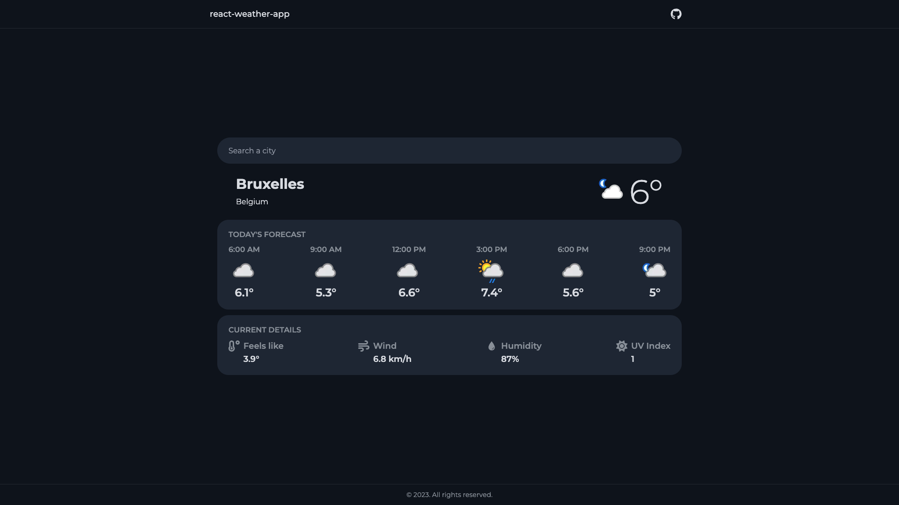

# react-weather-app

### What's this about?
An interactive weather application created in React and Tailwind that lets you check the weather forecast in real time.  
I created this application to get started in web development and learn react.

### Installation :
- Clone the repository.
- Run ```pnpm install``` to install the application dependencies.

### Configuration:
- Create an .env file at the root of the directory and add the following content to it.
- Add your https://www.weatherapi.com api key.
```env
VITE_WEATHER_API_URL=http://api.weatherapi.com/v1
VITE_WEATHER_API_KEY=
```

### Usage:
- Run ```pnpm run dev``` to start the application in development mode.   
- Run ```make``` to start the application in production mode with docker.


